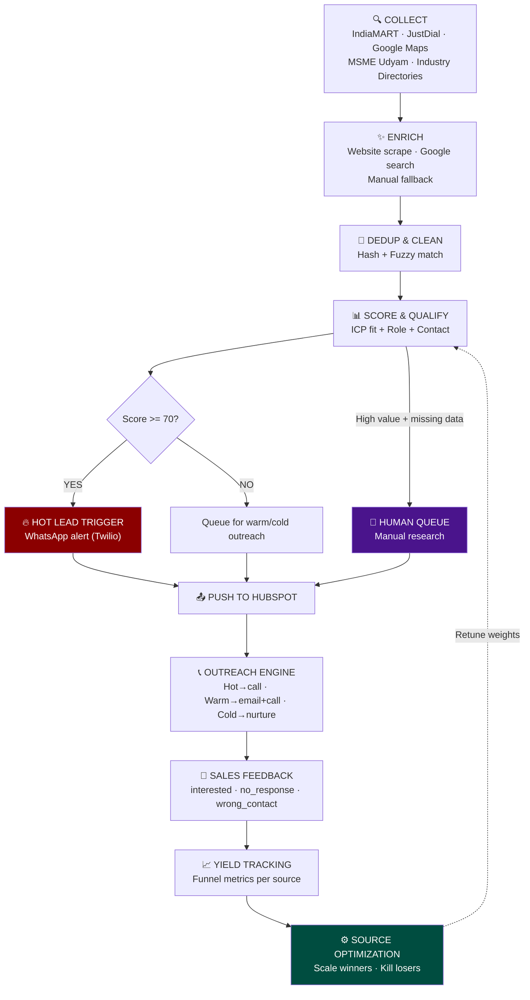
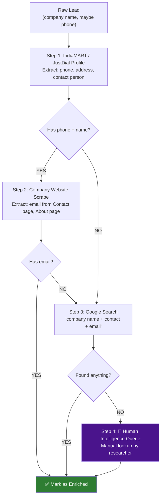
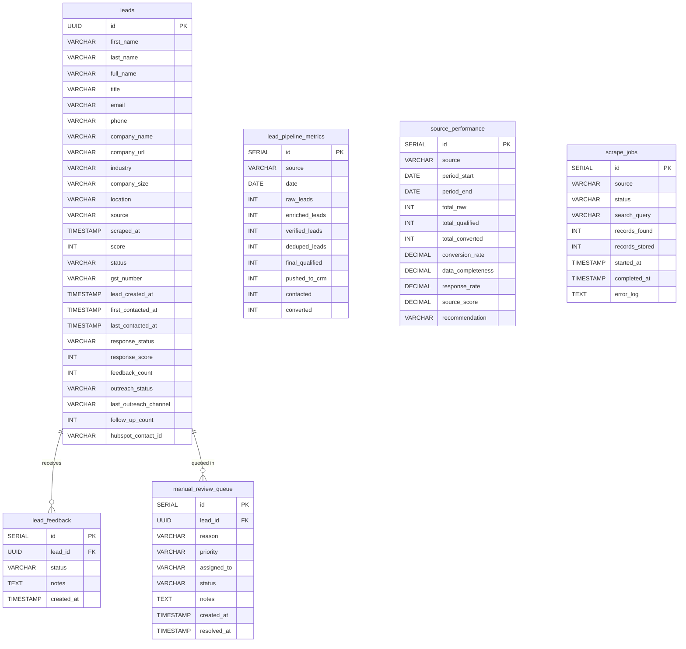
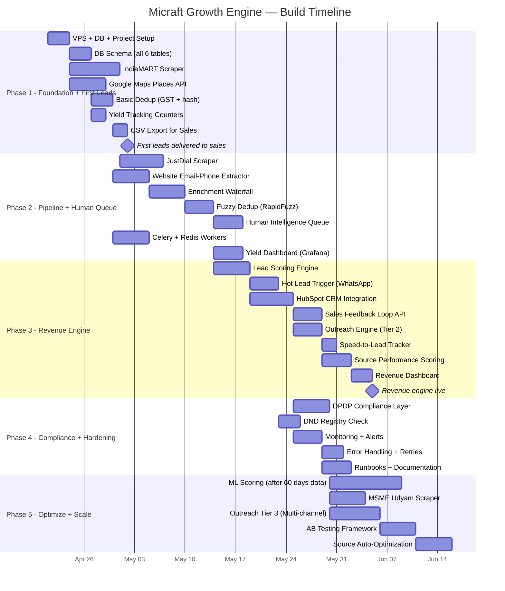

# Micraft Growth Engine — FULLY LOCKED System Architecture v4

> **Status:** ✅ ALL DECISIONS LOCKED — Ready for Build · **Date:** 2026-04-18 · **Author:** System Architect
> **Change:** All constraints, cities, team, infrastructure, and look-alike customers locked

---

## 1. System Summary

Micraft Solutions sells **MES** and **CMS** products to Indian SME manufacturers. We're building a **hybrid automated + manual lead engine** that generates **30–50 qualified leads/day** (scaling to 100 after optimization), scores them, triggers instant action on hot leads, pushes to HubSpot, collects sales feedback, and continuously optimizes itself.

### What "Qualified" Means (Locked)

A lead is qualified **ONLY** if ALL three conditions are met:

```
✅ Matches ICP (industry + size + India)
✅ Has a decision-maker (Owner / Plant Head / Production Manager)
✅ Has at least one verified contact method (phone PREFERRED)
```

Everything below this bar is a **raw lead**, not a qualified lead.

### Locked Parameters

| Parameter | Value |
|---|---|
| **Target Industries** | Automotive parts manufacturing, Plastic molding, Fabrication |
| **Company Size** | 20–200 employees |
| **Target Roles** | Owner, Plant Head, Production Manager |
| **Target Cities** | Pune, Mumbai MMR, Chennai, Ahmedabad |
| **Daily Target** | 30–50 qualified leads (scale to 100) |
| **Sales Capacity** | 2 reps, max 50–60 leads/day |
| **CRM** | HubSpot Free Tier |
| **Monthly Budget** | ₹10,000–₹25,000 ($120–$300 USD) |
| **Enrichment Strategy** | Scraping + website extraction + manual fallback (minimize paid APIs) |
| **Infrastructure** | Dedicated server (own hardware) |
| **Alert Channel** | WhatsApp (Twilio) |
| **Manual Research** | Supritha Patil (sales team member) |
| **Twilio** | User will set up account |

### Full Pipeline Flow



---

## 2. Budget-Aware Architecture Decisions

> [!IMPORTANT]
> The ₹10K–25K/month budget is the single biggest constraint. Every architectural decision below is optimized for this.

### What We CAN'T Afford

| Service | Typical Cost | Verdict |
|---|---|---|
| Apollo.io | $49–99/mo (~₹4K–8K) | ❌ Too expensive for limited value on Indian SMEs |
| Clearbit | $99+/mo | ❌ Primarily covers Western companies |
| ZoomInfo | $200+/mo | ❌ Way over budget |
| BrightData proxies | $100+/mo (~₹8K+) | ❌ Over budget; use free alternatives |
| NeverBounce (bulk) | $50+/mo | ⚠️ Only if needed; prefer free verification first |
| Airflow / managed k8s | $50+/mo | ❌ Over-engineered; use Celery on single VPS |

### What We CAN Afford / Use Free

| Service | Cost | Purpose |
|---|---|---|
| **IndiaMART scraping** | ₹0 (own scrapers) | Primary lead source — 7M+ seller profiles |
| **JustDial scraping** | ₹0 (own scrapers) | Phone numbers for Indian businesses |
| **Google Maps / Places API** | ₹0–1,500/mo (free tier: 28K calls/mo) | Company discovery by location |
| **Company website scraping** | ₹0 | Extract email/phone from "Contact Us" pages |
| **MSME Udyam registry** | ₹0 | Government database, public company info |
| **Hunter.io** | ₹0 (free: 25 searches/mo) | Minimal email lookup backup |
| **HubSpot CRM** | ₹0 (free tier) | CRM + basic email outreach |
| **Free proxies / ScraperAPI free tier** | ₹0–500 | Anti-bot rotation |
| **Twilio WhatsApp** | ₹500–1,500/mo | Hot lead alerts (~500 msgs) |
| **VPS (DigitalOcean/Hetzner)** | ₹2,000–5,000/mo | Single server: app + DB + Redis |
| **Manual enrichment (human time)** | ₹0–5,000/mo | Team member does manual research |

### Realistic Monthly Budget

| Item | Low | High |
|---|---|---|
| VPS (2 vCPU, 4GB RAM) | ₹2,000 | ₹4,000 |
| Domain + SSL | ₹100 | ₹200 |
| Google Places API overage | ₹0 | ₹1,500 |
| Twilio (WhatsApp alerts) | ₹500 | ₹1,500 |
| Proxy service (basic) | ₹0 | ₹2,000 |
| Email verification (pay-as-you-go) | ₹0 | ₹1,000 |
| Misc (DNS, backups) | ₹200 | ₹500 |
| **Buffer for paid API trials** | ₹0 | ₹5,000 |
| **Total** | **₹2,800** | **₹15,700** |

> [!TIP]
> This leaves ₹5K–10K headroom within the ₹25K cap — enough for emergencies or testing a paid enrichment tool for one month.

---

## 3. Enrichment Strategy (Budget-Optimized)

Since paid enrichment APIs are largely out of budget AND cover Indian SMEs poorly, we use a **zero-cost waterfall** with manual fallback:



### Enrichment Sources (Ranked by Priority)

| # | Source | Cost | What It Gives | Reliability for Indian SMEs |
|---|---|---|---|---|
| 1 | **IndiaMART profile** | Free | Phone, city, GST, contact name | 🟢 High — most sellers list mobile |
| 2 | **JustDial listing** | Free | Phone (primary), address | 🟢 High for established businesses |
| 3 | **Company website** | Free | Email, phone, About Us details | 🟡 Medium — many SMEs have bad websites |
| 4 | **Google Search** | Free | Email, social profiles, news mentions | 🟡 Medium — noisy but useful |
| 5 | **MSME Udyam portal** | Free | Registration details, employee count | 🟡 Medium — not all registered |
| 6 | **Manual research** | Time cost | Everything above, verified | 🟢 High — human judgment |
| 7 | **Hunter.io (free)** | Free (25/mo) | Email guess from domain | 🔴 Low for Indian SMEs |

### Key Insight

> [!NOTE]
> For Indian SME manufacturers, **phone numbers are MORE available and MORE valuable than emails**. IndiaMART and JustDial almost always show phone numbers. The system is designed phone-first.

---

## 4. Revenue Engine Modules (All 7)

### 🧩 Module 1: Lead Yield Tracking

**Table: `lead_pipeline_metrics`**

```sql
CREATE TABLE lead_pipeline_metrics (
    id              SERIAL PRIMARY KEY,
    source          VARCHAR(100) NOT NULL,
    date            DATE NOT NULL,
    raw_leads       INT DEFAULT 0,
    enriched_leads  INT DEFAULT 0,
    verified_leads  INT DEFAULT 0,
    deduped_leads   INT DEFAULT 0,
    final_qualified INT DEFAULT 0,
    pushed_to_crm   INT DEFAULT 0,
    contacted       INT DEFAULT 0,
    converted       INT DEFAULT 0,
    created_at      TIMESTAMP DEFAULT NOW(),
    UNIQUE(source, date)
);
```

**Dashboard:** Leads per source · Conversion funnel · Drop-off points · Cost per lead per source

---

### 🧩 Module 2: Sales Feedback Loop

**API:** `POST /api/lead-feedback`

```json
{
  "lead_id": "uuid",
  "status": "interested | not_interested | no_response | wrong_contact | converted",
  "notes": "optional",
  "timestamp": "auto"
}
```

**Additional leads table fields:**

| Field | Type |
|---|---|
| `last_contacted_at` | TIMESTAMP |
| `first_contacted_at` | TIMESTAMP |
| `response_status` | VARCHAR |
| `response_score` | INT (derived) |
| `feedback_count` | INT |
| `outreach_status` | VARCHAR |
| `last_outreach_channel` | VARCHAR |
| `follow_up_count` | INT |

**HubSpot Integration:** Map `response_status` to HubSpot contact properties. Use HubSpot webhook on deal stage change to auto-update feedback. Keeps reps in their familiar CRM — no extra tool.

---

### 🧩 Module 3: Hot Lead Trigger

**Logic:** `IF lead.score >= 70 → trigger_alert()`

**Channels:**
- 📱 WhatsApp (Twilio — ₹500–1500/mo)
- 💬 Slack (free webhook)
- 📧 Email (free via SMTP)

**Alert Payload:**
```
🔥 HOT LEAD

Company:  Sharma Auto Parts Pvt Ltd
Contact:  Rajesh Sharma — Plant Head
Location: Pune, Maharashtra
Phone:    +91 98xxx xxxxx
Score:    82/100
Source:   IndiaMART

⚡ Call within 15 minutes.
```

---

### 🧩 Module 4: Human Intelligence Queue

**Table: `manual_review_queue`**

```sql
CREATE TABLE manual_review_queue (
    id          SERIAL PRIMARY KEY,
    lead_id     UUID REFERENCES leads(id),
    reason      VARCHAR(50) NOT NULL,
    priority    VARCHAR(10) NOT NULL,
    assigned_to VARCHAR(100),
    status      VARCHAR(20) DEFAULT 'pending',
    notes       TEXT,
    created_at  TIMESTAMP DEFAULT NOW(),
    resolved_at TIMESTAMP
);
```

**Triggers:**

| Condition | Priority | Reason |
|---|---|---|
| Score ≥ 60 but no phone AND no email | 🔴 High | `high_value_missing_contact` |
| Company size > 100 employees | 🔴 High | `high_value` |
| Enrichment waterfall returned nothing | 🟡 Medium | `enrichment_failed` |
| Fuzzy dedup confidence 70–85% | 🟡 Medium | `fuzzy_dup_uncertain` |
| Company found but no contact person | 🟢 Low | `incomplete_data` |

**Budget note:** This is where a dedicated researcher (₹5K–15K/mo salary share) adds massive value. The automation handles 80%; humans handle the high-value 20%.

---

### 🧩 Module 5: Outreach Engine

**Routing:**

| Lead Type | Action | Who | When |
|---|---|---|---|
| 🔥 Hot (≥ 70) | Instant phone call | Sales rep (alerted via WhatsApp) | < 15 min |
| 🟡 Warm (40–69) | Email from HubSpot + call next day | Sales rep | < 24h |
| 🔵 Cold (< 40) | Email nurture sequence (HubSpot) | Automated | 3-touch over 14 days |

**Implementation Tiers:**

| Tier | Approach | Phase |
|---|---|---|
| **Tier 1 (MVP)** | Daily CSV export → sales calls manually | Phase 1 |
| **Tier 2** | HubSpot sequences + call list + feedback form | Phase 3 |
| **Tier 3** | Multi-channel (email + WhatsApp + call) with auto-scheduling | Phase 5 |

**HubSpot Free Tier Limits to Watch:**
- 200 emails/day (sufficient for 50 warm/cold leads)
- 1,000 API calls/day (≈ 40 leads/hour with upsert + property updates)
- No custom workflows on free tier → use Celery for automation logic

---

### 🧩 Module 6: Speed-to-Lead Tracker

**KPI:** `time_to_contact = first_contacted_at - lead_created_at`

| Lead Type | Target |
|---|---|
| 🔥 Hot | < 15 min |
| 🟡 Warm | < 4 hours |
| 🔵 Cold | < 24 hours |

**Dashboard Widget:** Real-time gauge for today's avg speed vs. target + 7-day trend.

---

### 🧩 Module 7: Source Performance Scoring

**Table: `source_performance`**

```sql
CREATE TABLE source_performance (
    id                  SERIAL PRIMARY KEY,
    source              VARCHAR(100) NOT NULL,
    period_start        DATE NOT NULL,
    period_end          DATE NOT NULL,
    total_raw           INT DEFAULT 0,
    total_qualified     INT DEFAULT 0,
    total_contacted     INT DEFAULT 0,
    total_converted     INT DEFAULT 0,
    conversion_rate     DECIMAL(5,2),
    data_completeness   DECIMAL(5,2),
    response_rate       DECIMAL(5,2),
    avg_lead_score      DECIMAL(5,2),
    source_score        DECIMAL(5,2),
    cost_per_lead       DECIMAL(10,2),
    recommendation      VARCHAR(20),
    created_at          TIMESTAMP DEFAULT NOW(),
    UNIQUE(source, period_start)
);
```

**Formula:**
```
source_score = (conversion_rate × 0.40) + (data_completeness × 0.25)
             + (response_rate × 0.25) + (avg_lead_score_normalized × 0.10)
```

**Auto-Recommendations:**

| Score | Action |
|---|---|
| ≥ 80 | 🟢 **SCALE** — increase frequency, expand search terms |
| 60–79 | 🟡 **MAINTAIN** — keep running, monitor |
| 40–59 | 🟠 **REDUCE** — Lower frequency, investigate |
| < 40 | 🔴 **KILL** — stop scraping this source |

---

## 5. Complete Database Schema



---

## 6. Risk Register

| # | Risk | Severity | Likelihood | Mitigation |
|---|---|---|---|---|
| R1 | **IndiaMART blocks scraping aggressively** | 🔴 Critical | High | Rotate free proxies, use stealth Playwright, throttle to 2–3 req/min, scrape during off-hours. If blocked, pivot to Google Maps + manual. |
| R2 | **JustDial anti-bot (OTP walls, JS challenges)** | 🟠 High | High | Playwright with stealth plugin. If too aggressive, deprioritize and rely on IndiaMART + Google Maps. |
| R3 | **Budget can't sustain proxy costs** | 🟡 Medium | Medium | Use free proxy lists + ScraperAPI free tier (1000 calls/mo). Rotate User-Agent strings. Worst case: slower scraping with own IP + delays. |
| R4 | **HubSpot Free Tier limits hit** | 🟠 High | Medium | 1000 API calls/day = ~40 upserts/hour. Batch CRM syncs 2x/day (morning + evening). Use bulk create endpoint. 200 email/day is sufficient for 50 warm/cold leads. |
| R5 | **Phone numbers are DND-registered** | 🟠 High | High | Check TRAI DND registry (free API available). Prefer calling business landlines. Use WhatsApp for mobile outreach (not regulated same as calls). |
| R6 | **Data quality: wrong contact person** | 🟠 High | High | Sales Feedback Loop (Module 2) catches this. `wrong_contact` status triggers re-enrichment or queue for manual research. |
| R7 | **Sales reps don't give feedback** | 🟠 High | High | Make feedback **1-click in HubSpot** (custom property dropdown). Show reps their speed-to-lead stats. Start with daily standup review of feedback. |
| R8 | **Scraper breakage from site redesigns** | 🟡 Medium | High | Monitor for zero-result runs → Slack alert. Each scraper is a separate module — fixing one doesn't break others. |
| R9 | **DPDP Act compliance** | 🟡 Medium | Medium | Scrape only publicly listed business info. Implement opt-out mechanism. Add unsubscribe to all emails. Log all data processing. |
| R10 | **30–50 qualified leads/day is ambitious** | 🟠 High | Medium | Could initially yield 15–25/day. Set expectations: Week 1–2 is calibration. Source Performance Scoring (Module 7) will identify which sources to scale. |
| R11 | **Single VPS is a bottleneck** | 🟡 Medium | Low | 2 vCPU / 4GB RAM handles this volume easily. PostgreSQL + Redis + FastAPI on one box is fine for < 1000 leads/day. Scale later only if needed. |
| R12 | **Manual enrichment becomes bottleneck** | 🟡 Medium | Medium | Auto-prioritize queue by lead score. High-value leads first. Set SLA: resolve high-priority within 4 hours, medium within 24 hours. |

---

## 7. Improvements Based on Constraints

Given the tight budget and India-specific focus, here are **targeted improvements** over the original spec:

### 🔄 Improvement 1: WhatsApp-First Outreach (Instead of Email-First)

**Why:** Indian SME owners check WhatsApp 50x more than email. HubSpot Free has 200 email/day limit anyway.

**How:** Use Twilio WhatsApp Business API for hot/warm leads. Email only for cold nurture.

**Cost:** ₹500–1500/mo for ~500 messages — well within budget.

### 🔄 Improvement 2: GST Number as Dedup Key

**Why:** Indian companies have unique GST numbers. If scraped from IndiaMART/website, this is the best dedup key — better than fuzzy name matching.

**How:** Add `gst_number` to leads table. Use as primary dedup key when available; fall back to company_name + phone.

### 🔄 Improvement 3: IndiaMART as 80% Source

**Why:** IndiaMART has ~7M seller profiles, mostly manufacturers, with phone numbers listed. For our ICP (automotive parts, plastics, fabrication), IndiaMART coverage is extremely deep.

**How:** Build the most robust scraper for IndiaMART. Other sources are supplementary. Source Performance Scoring will confirm or correct this hypothesis.

### 🔄 Improvement 4: HubSpot-Native Feedback (No Extra App)

**Why:** Sales reps won't use a separate system. They already live in HubSpot.

**How:** Add custom contact properties in HubSpot Free (unlimited custom properties):
- `lead_response_status` (dropdown)
- `lead_score` (number)
- `lead_source` (text)

Sync bi-directionally. Reps update status in HubSpot → webhook (or polling) → our DB.

### 🔄 Improvement 5: Cron on VPS (Not Celery Beat Initially)

**Why:** Celery + Redis + Beat + Flower is 4 processes. For a single VPS, start simpler.

**How:** Phase 1 uses `cron` + Python scripts for scheduled tasks. Move to Celery in Phase 2 when worker concurrency matters.

**Revised architecture for Phase 1:**
```
cron triggers → Python scraper scripts → PostgreSQL → FastAPI serves data
```

### 🔄 Improvement 6: Grafana on Same VPS (Free Dashboard)

**Why:** Metabase + Grafana are both free and self-hosted. Grafana connects directly to PostgreSQL.

**How:** Run Grafana on same VPS (port 3000). Pre-build 4 dashboards:
1. Lead Funnel (Module 1)
2. Source Performance (Module 7)
3. Speed-to-Lead (Module 6)
4. Feedback Overview (Module 2)

---

## 8. Phase-Wise Build Plan



---

### Phase 1 — Foundation + First Leads (Weeks 1–3)

> **Goal:** Get real leads into the hands of sales reps within 2 weeks. No perfection — just working pipeline.

| Deliverable | Details |
|---|---|
| **VPS Setup** | Single DigitalOcean/Hetzner VPS (2 vCPU, 4GB RAM, ₹2K–4K/mo). PostgreSQL + Redis installed. |
| **DB Schema** | All 6 tables created (leads, lead_pipeline_metrics, manual_review_queue, source_performance, lead_feedback, scrape_jobs) |
| **IndiaMART Scraper** | Playwright scraper targeting: "automotive parts manufacturer", "plastic molding company", "fabrication company". Extract: company name, contact name, phone, city, GST. Target: 100–200 raw leads/run. |
| **Google Maps Integration** | Places API for manufacturing companies in Pune, Chennai, Ahmedabad, Coimbatore, Ludhiana. |
| **Basic Dedup** | Deduplicate on GST number (if available) or company_name + phone hash. |
| **Yield Tracking** | Auto-increment `lead_pipeline_metrics` at each stage. |
| **CSV Export** | Daily CSV of qualified leads (filtered by ICP rules). Emailed to sales reps or dropped to shared folder. |

**Exit Criteria:**
- ✅ 200+ raw leads from 2 sources
- ✅ Sales reps calling from CSV by end of Week 2
- ✅ Pipeline metrics table has real data
- ✅ Know actual drop-off rate (raw → qualified)

**What We Skip (for now):** CRM integration, scoring, alerts, enrichment APIs, fuzzy dedup.

---

### Phase 2 — Core Pipeline + Human Queue (Weeks 4–6)

> **Goal:** Multi-source, enriched, deduplicated pipeline with human fallback for gaps.

| Deliverable | Details |
|---|---|
| **JustDial Scraper** | Phone-focused scraper for manufacturing businesses by city. |
| **Website Extractor** | Given a company URL, extract email/phone from Contact, About, Footer sections. |
| **Enrichment Waterfall** | IndiaMART profile → Website scrape → Google search → Human queue (zero paid APIs). |
| **Fuzzy Dedup** | RapidFuzz on company name (threshold ≥ 85) + exact match on phone/GST. |
| **Human Intelligence Queue (Module 4)** | Dashboard page listing leads needing manual research, sorted by priority. |
| **Celery + Redis** | Replace cron with proper workers: `scrape_worker`, `enrich_worker`, `dedup_worker`. |
| **Grafana Dashboard** | Funnel chart + source breakdown + daily trend. Runs on same VPS. |

**Exit Criteria:**
- ✅ 3+ sources active
- ✅ 50%+ of leads have verified phone
- ✅ < 5% duplicate rate
- ✅ Human queue items resolved within 24h

---

### Phase 3 — Revenue Engine (Weeks 7–10)

> **Goal:** The system becomes a revenue machine. Scoring → Alerts → CRM → Outreach → Feedback → Optimization.

| Deliverable | Details |
|---|---|
| **Lead Scoring** | Rule-based scorer (see table below) |
| **Hot Lead Trigger (Module 3)** | WhatsApp + Slack alert for score ≥ 70. |
| **HubSpot Integration** | Push leads via Contacts API. Map: company, name, phone, email, score, source. Batch sync 2x/day. |
| **Sales Feedback Loop (Module 2)** | `POST /api/lead-feedback` + HubSpot custom property sync. |
| **Outreach Engine Tier 2 (Module 5)** | Hot → call list in HubSpot. Warm → email template. Cold → 3-touch sequence. |
| **Speed-to-Lead (Module 6)** | Track timestamps, Grafana gauge widget. |
| **Source Performance (Module 7)** | Weekly computation, dashboard with recommendations. |
| **Revenue Dashboard** | Combined view: funnel + speed gauge + source scores + feedback summary. |

**Scoring Model (v1) — Tuned for ICP:**

| Signal | Points | Max |
|---|---|---|
| Industry = Automotive Parts / Plastics / Fabrication | +20 | 20 |
| Title = Owner | +15 | 15 |
| Title = Plant Head / Director | +12 | 12 |
| Title = Production Manager | +10 | 10 |
| Company size 20–200 employees | +10 | 10 |
| Has verified phone number | +15 | 15 |
| Has verified email | +5 | 5 |
| Location = Manufacturing hub city | +5 | 5 |
| Has GST number (verified business) | +5 | 5 |
| Multiple sources confirm data | +3 | 3 |
| Data freshness < 14 days | +5 | 5 |
| **Maximum** | | **100** |

> Note: Phone gets +15 while email gets +5. This reflects the Indian SME reality — phone is the money channel.

**Hot ≥ 70 · Warm 40–69 · Cold < 40**

**Exit Criteria:**
- ✅ Hot alerts firing within 60 seconds
- ✅ Leads auto-pushed to HubSpot
- ✅ Sales feedback flowing (≥ 30% of contacted leads have feedback within 1 week)
- ✅ Speed-to-lead for Hot leads < 30 min avg
- ✅ Source scores computed weekly

---

### Phase 4 — Compliance & Hardening (Weeks 11–13)

> **Goal:** Production-stable, compliant, self-healing.

| Deliverable | Details |
|---|---|
| **DPDP Compliance** | Opt-out endpoint, data retention (12-month auto-purge), processing logs |
| **DND Registry** | TRAI DND check before phone outreach. Skip DND numbers for calling (still allow WhatsApp/email). |
| **Monitoring** | Health checks on all workers. Slack alert on: scraper failure, zero results, queue depth > 50, HubSpot sync failure. |
| **Error Handling** | Retry with backoff on network errors. Dead-letter queue for persistent failures. |
| **Runbooks** | How to: add a source, fix a broken scraper, handle data deletion requests, restart services |

**Exit Criteria:** System runs unattended for 7 days. < 2% error rate. All alerts working.

---

### Phase 5 — Scale & Optimize (Weeks 14–20)

> **Goal:** Data-driven optimization. ML scoring. More sources. Full outreach automation.

| Deliverable | Details |
|---|---|
| **ML Scoring** | Train on 60+ days of feedback. XGBoost or logistic regression. Features: industry, title, size, source, location. |
| **MSME Udyam Scraper** | Government database — employee count, investment data, registration details. |
| **Outreach Tier 3** | Multi-channel sequences via WhatsApp + email + call, auto-scheduled. |
| **A/B Testing** | Test WhatsApp message templates, email subjects, call scripts — measure by response rate. |
| **Source Auto-Optimization** | Cron job adjusts scrape frequency based on source_score. High scorers run 2x/day, low scorers reduce to weekly. |

**Exit Criteria:**
- ✅ 30–50 qualified leads/day consistently
- ✅ ML model outperforms rule-based by ≥ 15%
- ✅ Speed-to-lead < 15 min for Hot
- ✅ Source allocation data-driven

---

## 9. HubSpot Free Tier — Constraints & Workarounds

> [!WARNING]
> HubSpot Free Tier has real limits. Here's how we work within them.

| Limit | Value | Our Approach |
|---|---|---|
| API calls | 100/10sec, 500K/day | More than enough. Batch upserts 2x/day. |
| Contacts | 1,000,000 | More than enough. |
| Custom properties | Unlimited | Use for: lead_score, source, response_status, outreach_status |
| Email sending | 200/day | Sufficient for 50 warm/cold leads. Hot leads get calls/WhatsApp, not email. |
| Workflows | ❌ Not available on Free | Use Celery workers for all automation logic. HubSpot is just the data layer for sales. |
| Lists | 25 active, 1000 static | Use 5 active lists: Hot, Warm, Cold, Contacted, Converted |
| Sequences | ❌ Not available on Free | Build email sequences in our app, send via HubSpot single-send API or SMTP |

**Key Decision:** HubSpot Free = **data store + sales interface**. All automation logic (scoring, alerts, sequences, feedback sync) lives in **our Celery workers**.

---

## 10. Project Structure (Proposed)

```
MicraftLeadGeneration/
├── app/
│   ├── main.py                      # FastAPI entry point
│   ├── config.py                    # Settings, env vars, budget limits
│   ├── models/                      # SQLAlchemy models (6 tables)
│   │   ├── lead.py
│   │   ├── scrape_job.py
│   │   ├── pipeline_metrics.py
│   │   ├── lead_feedback.py
│   │   ├── review_queue.py
│   │   └── source_performance.py
│   ├── api/
│   │   ├── leads.py                 # CRUD + search + CSV export
│   │   ├── feedback.py              # POST /lead-feedback
│   │   ├── review_queue.py          # Manual queue endpoints
│   │   ├── metrics.py               # Yield + source performance
│   │   └── health.py                # Health check endpoint
│   ├── scrapers/
│   │   ├── base.py                  # Abstract interface
│   │   ├── indiamart.py             # Primary source
│   │   ├── justdial.py
│   │   ├── google_maps.py
│   │   └── msme_udyam.py            # Phase 5
│   ├── enrichment/
│   │   ├── waterfall.py             # Zero-cost enrichment chain
│   │   ├── website_extractor.py     # Scrape contact from company site
│   │   └── google_search.py         # Google search for email/phone
│   ├── processing/
│   │   ├── dedup.py                 # GST-first, then hash, then fuzzy
│   │   ├── cleaner.py               # Normalize phones, names, addresses
│   │   ├── scorer.py                # ICP scoring + hot trigger
│   │   └── validator.py             # Phone format, email syntax
│   ├── revenue/                     # Revenue Engine modules
│   │   ├── hot_trigger.py           # Module 3
│   │   ├── outreach.py              # Module 5
│   │   ├── speed_tracker.py         # Module 6
│   │   ├── source_scorer.py         # Module 7
│   │   └── yield_tracker.py         # Module 1
│   ├── integrations/
│   │   ├── hubspot.py               # CRM sync (batch upsert)
│   │   ├── whatsapp.py              # Twilio WhatsApp alerts
│   │   ├── slack.py                 # Slack webhook
│   │   └── smtp.py                  # Email alerts + outreach
│   ├── workers/                     # Celery tasks (Phase 2+)
│   │   ├── scrape_tasks.py
│   │   ├── enrich_tasks.py
│   │   ├── process_tasks.py
│   │   ├── sync_tasks.py
│   │   ├── alert_tasks.py
│   │   └── analytics_tasks.py
│   └── utils/
│       ├── logging.py               # structlog setup
│       ├── proxy_manager.py         # Free proxy rotation
│       └── rate_limiter.py
├── dashboard/
│   └── grafana/                     # Pre-built dashboard JSON
│       ├── lead_funnel.json
│       ├── source_performance.json
│       ├── speed_to_lead.json
│       └── feedback_overview.json
├── migrations/                      # Alembic
├── tests/
│   ├── test_scrapers/
│   ├── test_enrichment/
│   ├── test_processing/
│   ├── test_revenue/
│   └── test_api/
├── scripts/
│   ├── seed_data.py                 # Test data for development
│   └── daily_export.py              # CSV export (Phase 1)
├── docker-compose.yml               # PostgreSQL + Redis + Grafana
├── requirements.txt
├── .env.example
└── README.md
```

---

## 11. Existing Customers — Look-Alike Profile

These 5 existing Micraft customers define the **ideal conversion profile**. The system will use these as reference signals for scoring and source selection.

| # | Company | Profile Analysis | Scoring Signals |
|---|---|---|---|
| 1 | **TM Seatings** | Automotive seating components manufacturer | Industry: Automotive parts ✅ · Likely 50–200 emp ✅ |
| 2 | **MSKH Seatings** | Automotive seating / interior components | Industry: Automotive parts ✅ · Similar profile to TM Seatings |
| 3 | **Tata Autocomp** | Tier-1 auto component supplier (Tata group) | Industry: Automotive parts ✅ · Larger enterprise — upper ICP boundary |
| 4 | **Track Components Ltd.** | Precision engineering / automotive parts | Industry: Automotive + Fabrication ✅ · Manufacturing-heavy |
| 5 | **Geon Batteries** | Battery manufacturing | Industry: Manufacturing (adjacent) · Process manufacturing |

### Look-Alike ICP Insights

From these 5 customers, we can extract patterns:

```
✅ 4 of 5 are automotive parts / components → Automotive is the #1 vertical
✅ All are manufacturers with production facilities
✅ Mix of Tier-1 suppliers (Tata Autocomp) and SMEs (TM/MSKH Seatings)
✅ Pune/Maharashtra presence likely (Tata Autocomp HQ: Pune)
✅ MES/CMS fits production-heavy environments
```

**Scoring boost:** In Phase 5 (ML scoring), leads that match these company profiles (automotive components, 50–500 employees, Pune/Mumbai region, production-focused) get a **look-alike bonus of +5 to +10 points**.

**Immediate use (Phase 1):** Use these company names to:
- Find **similar companies on IndiaMART** (search competitors/peers)
- Search **"companies like Tata Autocomp"** on Google Maps
- Look at **industry association member lists** that these companies belong to

---

## 12. All Decisions — FULLY LOCKED ✅

> [!IMPORTANT]
> **All decisions are locked. Zero pending items. System is ready for Phase 1 build.**

| # | Decision | Status | Value |
|---|---|---|---|
| D1 | CRM | ✅ **LOCKED** | HubSpot Free Tier |
| D2 | ICP Industries | ✅ **LOCKED** | Automotive parts, Plastic molding, Fabrication |
| D3 | Company Size | ✅ **LOCKED** | 20–200 employees |
| D4 | Target Roles | ✅ **LOCKED** | Owner, Plant Head, Production Manager |
| D5 | Qualified Lead Def | ✅ **LOCKED** | ICP match + decision-maker + verified contact (phone preferred) |
| D6 | Budget | ✅ **LOCKED** | ₹10K–25K/month |
| D7 | Enrichment Strategy | ✅ **LOCKED** | Scraping + website extraction + manual fallback |
| D8 | Sales Capacity | ✅ **LOCKED** | 2 reps (incl. Supritha Patil), 50–60 leads/day |
| D9 | Infrastructure | ✅ **LOCKED** | Dedicated server (own hardware) |
| D10 | Alert Channel | ✅ **LOCKED** | WhatsApp via Twilio (user setting up account) |
| D11 | Target Cities | ✅ **LOCKED** | Pune, Mumbai MMR, Chennai, Ahmedabad |
| D12 | Manual Research | ✅ **LOCKED** | Supritha Patil (assigned to Human Intelligence Queue) |
| D13 | Look-Alike Customers | ✅ **LOCKED** | TM Seatings, MSKH Seatings, Tata Autocomp, Track Components, Geon Batteries |

---

> [!CAUTION]
> **The ₹10K–25K budget works ONLY because we're going scraping-first with manual fallback.** If IndiaMART or JustDial block us hard, the fallback is Google Maps (free API) + manual research by Supritha. The system is designed to degrade gracefully, not fail.

---

> [!TIP]
> **🟢 SYSTEM FULLY LOCKED. Ready for Phase 1 build prompt.**
