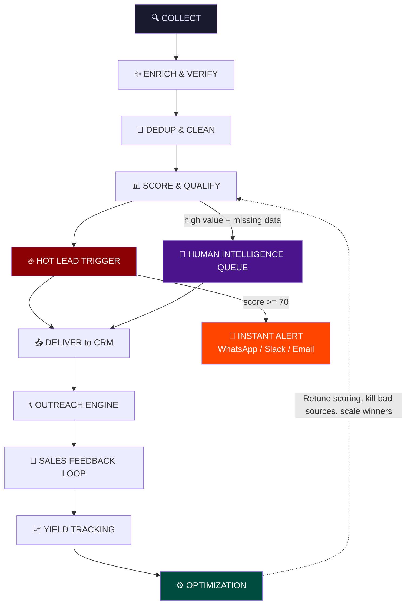
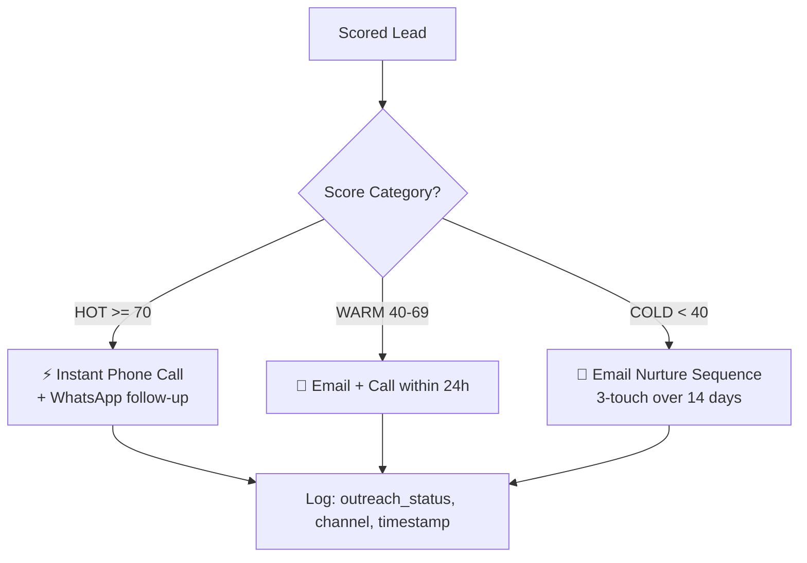
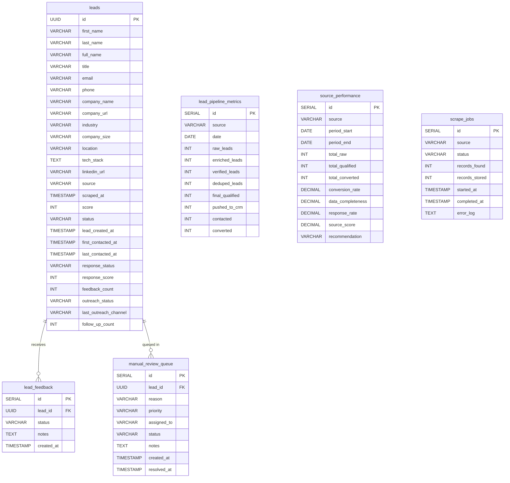
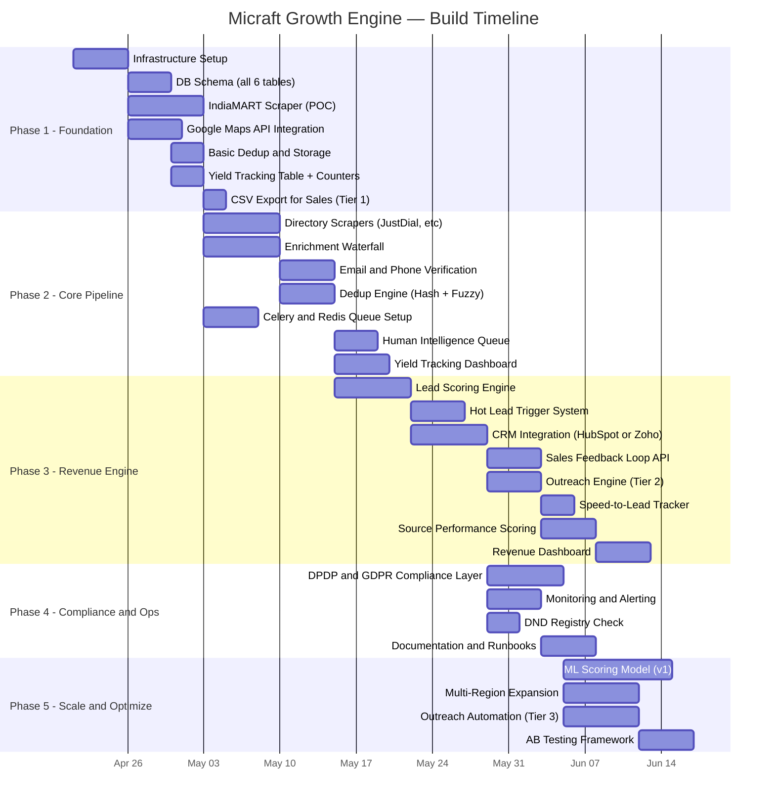

# Micraft Growth Engine — System Architecture & Analysis

> **Status:** Draft v2 (Revenue Engine Upgrade) · **Date:** 2026-04-18 · **Author:** System Architect

---

## 1. System Summary

Micraft Solutions sells **MES (Manufacturing Execution System)** and **CMS** products to the manufacturing sector. The business needs a steady funnel of **40–100 qualified B2B leads per day**, primarily targeting Indian SME manufacturers, with global expansion planned.

**This is NOT a data collection tool. This is a Revenue Engine.**

The system is an end-to-end **automated growth pipeline** with **10 stages** — from raw data collection through to revenue conversion and continuous self-optimization.

### Full Pipeline Flow



| Stage | What Happens | Key Concern |
|---|---|---|
| **Collect** | Scrape/API-pull company and contact data from IndiaMART, Google Maps, JustDial, directories | Anti-bot, ToS compliance, data freshness |
| **Enrich & Verify** | Fill missing fields via enrichment waterfall; validate emails & phones | API cost, rate limits, DPDP Act |
| **Dedup & Clean** | Hash + fuzzy-match to remove duplicates; normalize text, validate formats | False-positive merges, data loss |
| **Score & Qualify** | Rule-based (later ML) scoring: firmographics, title match, industry fit | Threshold tuning, cold-start |
| **🔥 Hot Lead Trigger** | Score ≥ 70 → instant alert via WhatsApp/Slack/Email to sales | Alert fatigue, latency |
| **Deliver** | Push scored leads to CRM with all metadata | API sync conflicts, field mapping |
| **📞 Outreach Engine** | Hot → instant call · Warm → email + call 24h · Cold → nurture | Sales capacity, channel priority |
| **🔁 Feedback Loop** | Sales reports outcomes → system learns what converts | Adoption by sales team |
| **📈 Yield Tracking** | Per-source funnel metrics: raw → enriched → qualified → converted | Dashboard accuracy |
| **⚙️ Optimization** | Kill bad sources, scale winners, retune scoring weights | Data-driven iteration |

### What makes this system different:

1. **India-first focus** — IndiaMART, JustDial, MSME Udyam, DIPP/MCA databases, Indian phone formats
2. **Manufacturing ICP** — Plant Heads, Production Managers, and Owners at factories
3. **MES/CMS product fit** — scoring weighs manufacturing-specific signals
4. **Revenue-driven** — Not just collection. Tracks from scrape all the way to conversion. The system _learns_.

---

## 2. Revenue Engine Modules (NEW)

These 7 modules transform a data pipeline into a revenue machine.

---

### 🧩 Module 1: Lead Yield Tracking System

**Purpose:** Stop guessing. Measure reality. Know within 7 days which source works and where leads die.

**New Table: `lead_pipeline_metrics`**

```sql
CREATE TABLE lead_pipeline_metrics (
    id              SERIAL PRIMARY KEY,
    source          VARCHAR(100) NOT NULL,
    date            DATE NOT NULL,
    raw_leads       INT DEFAULT 0,
    enriched_leads  INT DEFAULT 0,
    verified_leads  INT DEFAULT 0,
    deduped_leads   INT DEFAULT 0,
    final_qualified INT DEFAULT 0,
    pushed_to_crm   INT DEFAULT 0,
    contacted       INT DEFAULT 0,
    converted       INT DEFAULT 0,
    created_at      TIMESTAMP DEFAULT NOW(),
    UNIQUE(source, date)
);
```

**Dashboard Output:**
- Leads per source (daily/weekly/monthly)
- Conversion funnel with drop-off percentages
- Real cost per lead per source
- Trend lines for quality over time

---

### 🧩 Module 2: Sales Feedback Loop (CRITICAL)

**Purpose:** Turn the system into a learning machine. After 30–60 days, you'll know what actually converts and can build ML scoring.

**New API Endpoint:**

```
POST /api/lead-feedback
```

```json
{
  "lead_id": "uuid-123",
  "status": "interested | not_interested | no_response | wrong_contact | converted",
  "notes": "optional free text",
  "timestamp": "2026-04-18T10:30:00Z"
}
```

**New fields on `leads` table:**

| Field | Type | Description |
|---|---|---|
| `last_contacted_at` | TIMESTAMP | When sales last reached out |
| `first_contacted_at` | TIMESTAMP | When first outreach happened (for speed-to-lead) |
| `response_status` | VARCHAR | interested / not_interested / no_response / wrong_contact / converted |
| `response_score` | INT | Derived from feedback (auto-calculated) |
| `feedback_count` | INT | Number of feedback entries received |
| `outreach_status` | VARCHAR | pending / in_progress / completed / nurturing |
| `last_outreach_channel` | VARCHAR | phone / email / whatsapp / linkedin |
| `follow_up_count` | INT | Number of follow-ups done |

**Impact:**
- After 30 days → know what ICP segments actually convert
- After 60 days → have enough data to train ML scoring model
- After 90 days → fully data-driven source allocation

---

### 🧩 Module 3: Hot Lead Trigger System

**Purpose:** Speed = money. Indian SME decision-making is fast and human-driven. Delay = lost deal.

**Logic:**

```python
if lead.score >= 70:
    trigger_hot_alert(lead)
```

**Alert Channels (configurable):**
- 📱 **WhatsApp** (via Twilio API)
- 💬 **Slack** (webhook)
- 📧 **Email** (instant)

**Alert Payload:**

```
🔥 HOT LEAD ALERT

Company:  XYZ Manufacturing Pvt Ltd
Contact:  Rajesh Sharma — Plant Head
Location: Pune, Maharashtra
Industry: Automotive Parts
Phone:    +91 98xxx xxxxx
Score:    82/100

⚡ Call immediately.
```

**KPI:** `time_to_first_contact` for hot leads must be **< 15 minutes**.

---

### 🧩 Module 4: Human Intelligence Queue

**Purpose:** Automation handles 80%. This module intelligently handles the 20% that needs a human.

**New Table: `manual_review_queue`**

```sql
CREATE TABLE manual_review_queue (
    id          SERIAL PRIMARY KEY,
    lead_id     UUID REFERENCES leads(id),
    reason      VARCHAR(50) NOT NULL,  -- missing_email | high_value | incomplete_data | enrichment_failed | fuzzy_dup
    priority    VARCHAR(10) NOT NULL,  -- high | medium | low
    assigned_to VARCHAR(100),
    status      VARCHAR(20) DEFAULT 'pending',  -- pending | in_progress | resolved | skipped
    notes       TEXT,
    created_at  TIMESTAMP DEFAULT NOW(),
    resolved_at TIMESTAMP
);
```

**Trigger Conditions:**

| Condition | Priority | Reason |
|---|---|---|
| Score ≥ 70 but missing phone AND email | 🔴 High | `high_value` |
| Company size > 200 employees | 🔴 High | `high_value` |
| Enrichment APIs returned nothing | 🟡 Medium | `enrichment_failed` |
| Fuzzy dedup confidence 70–85% (uncertain) | 🟡 Medium | `fuzzy_dup` |
| Has company but no contact person | 🟢 Low | `incomplete_data` |

**Workflow:** Queue appears in dashboard → researcher picks task → fills data → lead re-enters pipeline for scoring.

---

### 🧩 Module 5: Outreach Engine

**Purpose:** Leads ≠ revenue. Outreach = revenue.

**Routing Logic:**



**Implementation Tiers:**

| Tier | Approach | When |
|---|---|---|
| **Tier 1 (MVP)** | Export CSV daily → sales team calls manually | Phase 1–2 |
| **Tier 2 (Better)** | CRM automation + email templates + call list | Phase 3 |
| **Tier 3 (Best)** | Multi-channel sequences (email + WhatsApp + call) with auto-scheduling | Phase 5 |

**Required Fields (on leads table):**

Already included in Module 2 fields: `outreach_status`, `last_outreach_channel`, `follow_up_count`.

---

### 🧩 Module 6: Speed-to-Lead Tracker

**Purpose:** Measure how fast sales contacts a new lead. Speed directly correlates with conversion.

**Fields (on leads table):**

| Field | Type | Description |
|---|---|---|
| `lead_created_at` | TIMESTAMP | When the lead entered the system |
| `first_contacted_at` | TIMESTAMP | When sales first reached out |

**Core KPI:**

```
time_to_contact = first_contacted_at - lead_created_at
```

**Targets:**

| Lead Type | Target Time |
|---|---|
| 🔥 Hot (≥ 70) | < 15 minutes |
| 🟡 Warm (40–69) | < 4 hours |
| 🔵 Cold (< 40) | < 24 hours |

**Dashboard Widget:** Real-time gauge showing average time-to-contact for today vs. target, with trend over last 7 days.

---

### 🧩 Module 7: Source Performance Scoring

**Purpose:** Double down on what works. Kill what doesn't.

**New Computed Field: `source_score`**

Calculated weekly per source, stored in `source_performance` table:

```sql
CREATE TABLE source_performance (
    id                  SERIAL PRIMARY KEY,
    source              VARCHAR(100) NOT NULL,
    period_start        DATE NOT NULL,
    period_end          DATE NOT NULL,
    total_raw           INT DEFAULT 0,
    total_qualified     INT DEFAULT 0,
    total_contacted     INT DEFAULT 0,
    total_converted     INT DEFAULT 0,
    conversion_rate     DECIMAL(5,2),       -- converted / qualified
    data_completeness   DECIMAL(5,2),       -- % of fields filled
    response_rate       DECIMAL(5,2),       -- responded / contacted
    avg_lead_score      DECIMAL(5,2),
    source_score        DECIMAL(5,2),       -- composite weighted score
    cost_per_lead       DECIMAL(10,2),      -- if cost tracking available
    recommendation      VARCHAR(20),        -- scale | maintain | reduce | kill
    created_at          TIMESTAMP DEFAULT NOW(),
    UNIQUE(source, period_start)
);
```

**Source Score Formula:**

```
source_score = (conversion_rate * 0.40)
             + (data_completeness * 0.25)
             + (response_rate * 0.25)
             + (avg_lead_score_normalized * 0.10)
```

**Automated Recommendations:**

| Source Score | Recommendation |
|---|---|
| ≥ 80 | 🟢 **SCALE** — increase scrape frequency, expand search terms |
| 60–79 | 🟡 **MAINTAIN** — keep running, monitor |
| 40–59 | 🟠 **REDUCE** — decrease frequency, investigate issues |
| < 40 | 🔴 **KILL** — stop scraping, reallocate budget |

---

## 3. Complete Database Schema



---

## 4. Risk Register

| # | Risk | Severity | Likelihood | Mitigation |
|---|---|---|---|---|
| R1 | **LinkedIn scraping → account ban / legal action** | 🔴 Critical | High | Avoid direct scraping; use Apollo.io / Lusha APIs for LinkedIn data. Use LinkedIn's official API for company pages only. |
| R2 | **Low email availability for Indian SME contacts** | 🟠 High | High | Multi-source enrichment waterfall (IndiaMART profile → company website → Hunter.io → manual). Fallback to phone-first outreach. |
| R3 | **Google Maps rate-limiting / CAPTCHA** | 🟡 Medium | Medium | Use official Places API (paid, ~$17/1000 requests). Budget $200–500/month for API costs. |
| R4 | **GDPR/DPDP Act compliance violations** | 🔴 Critical | Medium | India's DPDP Act 2023 is now in effect. Implement consent logging, opt-out workflows, and data retention policies from Day 1. |
| R5 | **Data quality: stale/incorrect scraped data** | 🟠 High | High | Email verification (ZeroBounce/NeverBounce), phone validation (Twilio Lookup), freshness decay scoring. |
| R6 | **Enrichment API costs spiral** | 🟠 High | Medium | Implement waterfall enrichment (cheapest source first). Cache results. Set monthly budget caps with alerts. |
| R7 | **Duplicate leads pollute CRM** | 🟡 Medium | Medium | Multi-layer dedup: exact hash → fuzzy match → CRM query before insert. |
| R8 | **Scraper breakage from site redesigns** | 🟡 Medium | High | Monitoring + alerts on zero-result runs. Modular scraper design so fixing one source doesn't affect others. |
| R9 | **Single point of failure (monolith)** | 🟡 Medium | Low | Microservice/module architecture with independent queues per stage. |
| R10 | **Cold-start for lead scoring** | 🟡 Medium | High | Start with rule-based scoring. Feedback loop (Module 2) collects conversion data for ML after 60 days. |
| R11 | **Team capacity / maintenance burden** | 🟠 High | Medium | Automate monitoring. Document everything. Keep tech stack simple (avoid Kubernetes until needed). |
| R12 | **Phone number compliance (DND/TRAI)** | 🟠 High | High | For India: check against TRAI DND registry before cold-calling. Use business landline numbers where possible. |
| R13 | **Sales team doesn't use feedback loop** | 🟠 High | High | Make feedback dead-simple (1-click in CRM). Show sales their own speed-to-lead stats. Gamify it. |
| R14 | **Hot lead alert fatigue** | 🟡 Medium | Medium | Tune score threshold (start at 75, adjust to 70 based on volume). Cap alerts to max 20/day per rep. |
| R15 | **Manual review queue becomes backlog** | 🟡 Medium | Medium | Auto-escalate unresolved items after 48h. Dashboard shows queue depth + aging. |

---

## 5. Gap Analysis

| # | Gap | Impact | Recommendation |
|---|---|---|---|
| G1 | **No India-specific data sources** — spec references YellowPages (US), Crunchbase | 🔴 Critical | Add IndiaMART, JustDial, IndiaBizList, Zauba Corp, MSME Udyam as primary sources |
| G2 | **No manufacturing-specific ICP definition** | 🟠 High | Define 3–5 manufacturing sub-verticals with employee-count ranges |
| G3 | **No budget/cost model** | 🟠 High | See §8 Cost Estimation below |
| G4 | **Phone-first outreach not addressed** | 🟠 High | Outreach Engine (Module 5) now addresses this |
| G5 | ~~No outreach integration~~ | ✅ Resolved | Outreach Engine with 3-tier routing |
| G6 | **No data retention/purge policy** | 🟡 Medium | Define 12-month retention with auto-archive |
| G7 | ~~Scoring model lacks feedback~~ | ✅ Resolved | Sales Feedback Loop (Module 2) feeds back into scoring |
| G8 | ~~No fallback for enrichment failure~~ | ✅ Resolved | Human Intelligence Queue (Module 4) handles enrichment failures |
| G9 | ~~Dashboard / reporting not specified~~ | ✅ Resolved | Yield Tracking (Module 1) + Source Performance (Module 7) |
| G10 | ~~No speed-to-lead measurement~~ | ✅ Resolved | Speed-to-Lead Tracker (Module 6) |

> [!NOTE]
> Revenue Engine modules resolve 5 of the original 9 gaps. Remaining gaps (G1, G2, G3, G6) require business input.

---

## 6. Clarifying Questions

### 🏭 Business & ICP

| # | Question | Why It Matters |
|---|---|---|
| Q1 | **Which manufacturing sub-verticals are highest priority?** (automotive, pharma, FMCG, textiles, plastics, metal fabrication, electronics?) | Determines which directories/sources to prioritize and how to tune scoring |
| Q2 | **What company size range defines "SME"?** (10–50 employees? 50–500? Revenue bracket?) | Directly impacts firmographic scoring rules and source selection |
| Q3 | **Is there an existing customer list we can use as a "look-alike" model?** | Dramatically improves scoring accuracy if we have conversion data |
| Q4 | **What does "qualified lead" mean precisely?** (Has email? Matches ICP? Responds to outreach?) | Defines the "40–100 daily" target — raw leads vs. qualified are very different |

### 🛠️ Technical

| # | Question | Why It Matters |
|---|---|---|
| Q5 | **Which CRM is currently in use or preferred?** (HubSpot, Salesforce, Zoho, custom?) | Determines integration effort and API constraints |
| Q6 | **Where will this be hosted?** (On-prem server, AWS, Azure, GCP, DigitalOcean?) | Affects infrastructure decisions, cost, and scaling approach |
| Q7 | **Is there existing infrastructure?** (PostgreSQL instance, Redis, any Python services running?) | Avoid duplicate provisioning |
| Q8 | **Team composition** — who will maintain this? (1 dev? Dedicated DevOps? Marketing team?) | Determines complexity ceiling — if 1 dev, avoid Kubernetes/Airflow |

### 💰 Budget & Operations

| # | Question | Why It Matters |
|---|---|---|
| Q9 | **Monthly budget for APIs and tools?** (Enrichment APIs: $100–2000/mo range; Proxies: $50–500/mo) | Decides enrichment waterfall and proxy strategy |
| Q10 | **Is manual enrichment/research acceptable as a fallback?** | For Indian SMEs, automated enrichment often fails; human researchers may be needed |
| Q11 | **Outreach channel priority?** (Email-first? Phone-first? LinkedIn InMail?) | Indian SME owners respond more to phone calls than cold emails |

### ⚖️ Compliance

| # | Question | Why It Matters |
|---|---|---|
| Q12 | **Are we prepared for India's DPDP Act 2023 requirements?** | Need consent management, data subject rights portal, breach notification |
| Q13 | **Will we be reaching out to EU/UK contacts in the global phase?** | GDPR compliance adds significant engineering effort |
| Q14 | **Do we have legal sign-off on scraping IndiaMART / JustDial?** | These are the richest Indian sources but have aggressive anti-scraping |

### 📊 Success Metrics

| # | Question | Why It Matters |
|---|---|---|
| Q15 | **What's the expected conversion rate from lead → demo → customer?** | Helps validate if 40–100 leads/day is sufficient for revenue targets |
| Q16 | **Is there a sales team ready to work these leads?** How many callers/SDRs? | Hot lead alerts are useless if nobody picks up the phone in 15 minutes |
| Q17 | **How will lead quality be measured post-delivery?** | Feedback Loop (Module 2) needs sales buy-in to work |
| Q18 | **Timeline expectation?** (MVP in 4 weeks? Production in 3 months?) | Determines scope of Phase 1 |

---

## 7. Phase-Wise Build Plan

### Overview



---

### Phase 1 — Foundation (Weeks 1–3)

> **Goal:** Prove the pipeline works end-to-end with one source, producing real leads. Include yield tracking from Day 1.

| Deliverable | Details |
|---|---|
| **Infrastructure** | PostgreSQL, Redis, FastAPI skeleton, project structure, Docker Compose |
| **DB Schema (all 6 tables)** | `leads`, `lead_pipeline_metrics`, `manual_review_queue`, `source_performance`, `lead_feedback`, `scrape_jobs` |
| **IndiaMART Scraper** | Playwright-based scraper for manufacturing companies. Target: 50–100 companies/run |
| **Google Maps Integration** | Places API integration for "manufacturing companies in [city]" |
| **Basic Pipeline** | Scrape → Parse → Store → Deduplicate (exact-match on company name + phone) |
| **Yield Tracking (Module 1)** | Auto-increment `lead_pipeline_metrics` counters at each pipeline stage |
| **CSV Export (Outreach Tier 1)** | Daily CSV export of qualified leads for sales team to call manually |
| **Logging** | Structured logging (Python `structlog`), per-job run tracking |

**Exit Criteria:**
- 200+ raw leads collected from 2 sources, stored in PostgreSQL
- Zero duplicates
- `lead_pipeline_metrics` table populated with real counts
- Sales team has CSV to call

**Tech Decisions:**
- FastAPI for API layer (async, fast, great docs)
- Playwright for JS-heavy sites; `requests` + BeautifulSoup for simple ones
- PostgreSQL (not MongoDB) — structured lead data benefits from SQL joins and constraints
- Redis + Celery for task queue (not Airflow — too heavy for a small team)

---

### Phase 2 — Core Pipeline (Weeks 4–6)

> **Goal:** Multi-source ingestion with enrichment, verification, and human fallback.

| Deliverable | Details |
|---|---|
| **Additional Scrapers** | JustDial, Zauba Corp, MSME Udyam registry, industry association sites |
| **Enrichment Waterfall** | Company website → IndiaMART profile → Apollo → Hunter.io → Manual queue |
| **Email Verification** | ZeroBounce / NeverBounce batch verification |
| **Phone Verification** | Format validation (Indian mobile/landline patterns), optional Twilio Lookup |
| **Fuzzy Dedup** | RapidFuzz-based matching on company name + person name (threshold ≥ 85) |
| **Queue System** | Celery workers: `scrape_worker`, `enrich_worker`, `verify_worker`, `dedup_worker` |
| **Human Intelligence Queue (Module 4)** | Auto-queue high-value leads with missing data or uncertain dedup matches |
| **Yield Dashboard v1** | Metabase/Grafana: funnel chart, source breakdown, drop-off points |

**Exit Criteria:**
- 3+ sources active
- Enrichment filling 60%+ of missing emails
- < 5% duplicate rate
- Human queue active with < 48h resolution time

---

### Phase 3 — Revenue Engine (Weeks 7–10)

> **Goal:** This is where it becomes a revenue machine. Scoring, triggers, feedback, outreach — all wired together.

| Deliverable | Details |
|---|---|
| **Lead Scoring Engine** | Rule-based scorer (see scoring model below) |
| **🔥 Hot Lead Trigger (Module 3)** | Score ≥ 70 → instant WhatsApp + Slack + Email alert to sales |
| **CRM Sync** | Bi-directional sync with HubSpot/Zoho (upsert on email or phone+company) |
| **Sales Feedback Loop (Module 2)** | `POST /api/lead-feedback` endpoint + CRM integration for 1-click feedback |
| **Outreach Engine Tier 2 (Module 5)** | CRM automation: Hot → call list, Warm → email template, Cold → nurture sequence |
| **Speed-to-Lead Tracker (Module 6)** | Track `lead_created_at` vs `first_contacted_at`, dashboard gauge |
| **Source Performance Scoring (Module 7)** | Weekly computation, auto-recommendations (scale/maintain/reduce/kill) |
| **Revenue Dashboard** | Combined dashboard: funnel + speed-to-lead gauge + source scores + feedback stats |

**Scoring Model (v1):**

| Signal | Points | Max |
|---|---|---|
| Industry = Manufacturing | +15 | 15 |
| Sub-vertical match (automotive, pharma, etc.) | +10 | 10 |
| Title = Owner / Plant Head / Director | +15 | 15 |
| Title = Production Manager / Operations | +10 | 10 |
| Company size 50–500 employees | +10 | 10 |
| Location = India Tier 1/2 city | +5 | 5 |
| Has verified email | +10 | 10 |
| Has phone number | +10 | 10 |
| Multiple sources confirm data | +5 | 5 |
| Data freshness < 30 days | +5 | 5 |
| **Engagement (later):** email opened / website visited | +5 each | 10 |

**Hot ≥ 70 · Warm 40–69 · Cold < 40**

**Exit Criteria:**
- Hot lead alerts firing within 60 seconds of score computation
- Sales feedback flowing back (≥ 50% of contacted leads have feedback)
- Speed-to-lead: Hot leads contacted in < 30 min avg (target: < 15 min by Phase 5)
- Source scores computed weekly with actionable recommendations

---

### Phase 4 — Compliance & Operations (Weeks 11–13)

> **Goal:** Production-ready with compliance, monitoring, and documentation.

| Deliverable | Details |
|---|---|
| **DPDP Act Compliance** | Consent logging, opt-out API endpoint, data retention policy (auto-purge after 12 months) |
| **DND Registry** | Check Indian phone numbers against TRAI DND registry before outreach |
| **Monitoring** | Health checks, Celery Flower dashboard, error rate alerts (Slack/email), job duration tracking |
| **Rate-Limit Management** | Per-source rate limiters, circuit breakers for enrichment APIs |
| **Runbooks** | Operational docs: how to add a new source, restart failed jobs, handle data subject requests |

**Exit Criteria:** System runs unattended for 7 days with < 2% error rate. Compliance audit checklist passed.

---

### Phase 5 — Scale & Optimize (Weeks 14–20)

> **Goal:** Data-driven optimization. ML scoring. Multi-region. Full outreach automation.

| Deliverable | Details |
|---|---|
| **ML Scoring (v1)** | Train on 60+ days of feedback data (Module 2). Logistic regression or XGBoost. Replace/augment rule-based model. |
| **Multi-Region** | Add sources for Southeast Asia, Middle East, then global directories |
| **Outreach Automation Tier 3 (Module 5)** | Multi-channel sequences: email + WhatsApp + call, auto-scheduling, A/B variants |
| **A/B Testing** | Test email subject lines, outreach timing, scoring thresholds |
| **Source Optimization** | Auto-scale winning sources (increase frequency), auto-reduce losers |
| **Scaling** | Containerize workers (Docker), add horizontal scaling if volume demands it |

**Exit Criteria:**
- 40–100 qualified leads/day consistently
- ML model outperforms rule-based by ≥ 15% on conversion rate
- Speed-to-lead < 15 min for Hot leads
- Source allocation fully data-driven

---

## 8. Cost Estimation Framework

> [!NOTE]
> Actual costs depend on answers to Q6, Q9. These are estimates for planning.

| Category | Tool/Service | Estimated Monthly Cost |
|---|---|---|
| **Infrastructure** | VPS or cloud (2–4 vCPU, 8GB RAM) | $40–100 |
| **Database** | PostgreSQL (managed or self-hosted) | $0–50 |
| **Proxies** | Residential proxy pool (BrightData / similar) | $100–300 |
| **Enrichment APIs** | Apollo.io (starter) + Hunter.io | $100–400 |
| **Email Verification** | ZeroBounce / NeverBounce | $50–100 |
| **Google Places API** | ~5000 requests/month | $85 |
| **CRM** | HubSpot Free / Zoho Starter | $0–50 |
| **WhatsApp/Twilio** | Hot lead alerts (~500 msgs/month) | $25–50 |
| **Monitoring** | Self-hosted Grafana + Metabase | $0 |
| **Total Estimate** | | **$400–1,135/month** |

---

## 9. Architecture Decision Records (ADRs)

### ADR-1: PostgreSQL over MongoDB

- **Decision:** Use PostgreSQL as the primary data store.
- **Rationale:** Lead data is highly structured (fixed schema with known fields). SQL JOINs are needed for dedup queries, yield tracking aggregations, and source performance computation. PostgreSQL's `ON CONFLICT` clause handles upserts elegantly. JSONB columns available if we need semi-structured data later.
- **Trade-off:** Slight schema migration overhead vs. MongoDB's flexibility. Acceptable given data predictability.

### ADR-2: Celery + Redis over Airflow

- **Decision:** Use Celery with Redis as the task queue/scheduler instead of Apache Airflow.
- **Rationale:** Airflow is powerful but operationally heavy (separate webserver, scheduler, DB). For a small team, Celery is simpler to deploy, debug, and monitor. Celery Beat handles cron scheduling. Can migrate to Airflow later if DAG complexity warrants it.
- **Trade-off:** Less visibility into DAG dependencies. Mitigated by good logging and Flower dashboard.

### ADR-3: India-First Data Sources

- **Decision:** Prioritize IndiaMART, JustDial, Google Maps (India), MSME Udyam over Western sources (LinkedIn, YellowPages US).
- **Rationale:** Target market is Indian SME manufacturers. IndiaMART has ~7M seller profiles with direct contact info. JustDial has business phone numbers. Western directories yield low India coverage.
- **Trade-off:** These sites have aggressive anti-scraping. May need to consider their official APIs or partnerships.

### ADR-4: Waterfall Enrichment Pattern

- **Decision:** Implement enrichment as a prioritized waterfall (cheapest/fastest source first, then fallback to Human Intelligence Queue).
- **Rationale:** No single enrichment provider covers Indian SMEs well. By chaining multiple sources (company website scrape → IndiaMART profile → Apollo → **manual queue**), we maximize fill rate while minimizing cost. Module 4 (Human Intelligence Queue) is the last resort, not a failure.

### ADR-5: Feedback-Driven Scoring (NEW)

- **Decision:** Start with rule-based scoring, transition to ML after 60 days of feedback data.
- **Rationale:** Cold-start problem — no historical conversion data exists. Rule-based scoring gets leads moving immediately. The Sales Feedback Loop (Module 2) collects structured outcome data. After 60 days with sufficient volume (~1800+ feedback entries at 30/day), train an ML model. Keep rule-based as fallback.
- **Trade-off:** First 60 days of scoring may not be optimal. Mitigated by conservative thresholds + human judgment via Hot Lead alerts.

### ADR-6: Speed-to-Lead as First-Class KPI (NEW)

- **Decision:** Track speed-to-lead from Day 1, with hard targets (< 15 min for Hot leads).
- **Rationale:** Harvard Business Review research shows leads contacted within 5 minutes are 21x more likely to qualify. For Indian SME decision-makers who are mobile-first and relationship-driven, speed is even more critical. Hot Lead Trigger (Module 3) exists specifically to make sub-15-minute contact possible.

---

## 10. Project Structure (Proposed)

```
MicraftLeadGeneration/
├── app/
│   ├── main.py                      # FastAPI entry point
│   ├── config.py                    # Settings, env vars
│   ├── models/                      # SQLAlchemy models
│   │   ├── lead.py                  # leads table
│   │   ├── company.py               # companies (optional)
│   │   ├── scrape_job.py            # scrape_jobs table
│   │   ├── pipeline_metrics.py      # lead_pipeline_metrics (Module 1)
│   │   ├── lead_feedback.py         # lead_feedback (Module 2)
│   │   ├── review_queue.py          # manual_review_queue (Module 4)
│   │   └── source_performance.py    # source_performance (Module 7)
│   ├── api/                         # API routes
│   │   ├── leads.py                 # CRUD + search
│   │   ├── feedback.py              # POST /lead-feedback (Module 2)
│   │   ├── review_queue.py          # Manual queue endpoints (Module 4)
│   │   ├── metrics.py               # Yield tracking + source perf
│   │   └── export.py               # CSV export for sales
│   ├── scrapers/                    # One module per source
│   │   ├── base.py                  # Abstract scraper interface
│   │   ├── indiamart.py
│   │   ├── justdial.py
│   │   ├── google_maps.py
│   │   └── directory_generic.py
│   ├── enrichment/                  # Enrichment waterfall
│   │   ├── base.py
│   │   ├── waterfall.py             # Orchestrates the chain
│   │   ├── apollo.py
│   │   ├── hunter.py
│   │   └── website_scraper.py
│   ├── processing/                  # Data processing
│   │   ├── dedup.py
│   │   ├── cleaner.py
│   │   ├── scorer.py               # Lead scoring (Module 3 trigger lives here)
│   │   └── validator.py
│   ├── revenue/                     # 🔥 Revenue Engine modules
│   │   ├── hot_trigger.py           # Module 3: Hot Lead Trigger
│   │   ├── outreach.py              # Module 5: Outreach routing logic
│   │   ├── speed_tracker.py         # Module 6: Speed-to-Lead
│   │   ├── source_scorer.py         # Module 7: Source Performance
│   │   └── yield_tracker.py         # Module 1: Pipeline metrics updater
│   ├── integrations/                # External systems
│   │   ├── crm/
│   │   │   ├── hubspot.py
│   │   │   └── zoho.py
│   │   ├── alerts/
│   │   │   ├── whatsapp.py          # Twilio WhatsApp (Module 3)
│   │   │   ├── slack.py             # Slack webhook (Module 3)
│   │   │   └── email_alert.py       # Email alert (Module 3)
│   │   └── verification/
│   │       ├── email_verify.py
│   │       └── phone_verify.py
│   ├── workers/                     # Celery tasks
│   │   ├── scrape_tasks.py
│   │   ├── enrich_tasks.py
│   │   ├── process_tasks.py
│   │   ├── sync_tasks.py
│   │   ├── alert_tasks.py           # Hot lead alert worker
│   │   └── analytics_tasks.py       # Source scoring, yield computation
│   └── utils/
│       ├── logging.py
│       ├── proxy_manager.py
│       └── rate_limiter.py
├── dashboard/                       # Metabase/Grafana config
│   ├── grafana_dashboards/
│   └── metabase_questions/
├── migrations/                      # Alembic DB migrations
├── tests/                           # pytest test suite
│   ├── test_scrapers/
│   ├── test_enrichment/
│   ├── test_processing/
│   ├── test_revenue/                # Tests for all 7 revenue modules
│   └── test_api/
├── scripts/                         # Utility scripts
├── docker-compose.yml               # PostgreSQL + Redis + App + Metabase
├── requirements.txt
├── .env.example
└── README.md
```

---

## 11. Key Decisions Needed Before Coding

> [!IMPORTANT]
> The following decisions **must** be locked before we write a single line of code:

| # | Decision | Options | Recommendation |
|---|---|---|---|
| D1 | **CRM Selection** | HubSpot (free tier) / Zoho CRM / Salesforce / Custom | HubSpot Free (upgrade later) |
| D2 | **Hosting** | Local dev → Cloud (AWS/Azure/DigitalOcean) | Start local Docker, plan for DigitalOcean or AWS |
| D3 | **Primary India sources** | IndiaMART / JustDial / Google Maps / MSME registry | All four, phased |
| D4 | **Enrichment budget** | $0 (manual only) / $100–200/mo / $500+/mo | $150–300/mo to start |
| D5 | **Outreach channel** | Email-first / Phone-first / Multi-channel | Phone + Email (Indian SMEs respond to calls) |
| D6 | **Team size for maintenance** | 1 dev / 2 devs / dev + data researcher | Minimum: 1 dev + 1 researcher |
| D7 | **"Qualified lead" definition** | ICP match only / ICP + verified contact / ICP + responded | ICP match + at least 1 verified contact method |
| D8 | **Alert channels for Hot Leads** | WhatsApp only / Slack only / Multi-channel | WhatsApp + Slack (sales team is mobile-first) |
| D9 | **Sales feedback mechanism** | API only / CRM-embedded / Mobile app | CRM-embedded 1-click + API fallback |

---

> [!CAUTION]
> **Without Revenue Engine modules:** You build a data factory — leads pile up, nobody calls, no feedback, no learning, no revenue.
>
> **With Revenue Engine modules:** You build a **growth machine** — leads flow, sales acts fast, system learns what converts, bad sources die, good sources scale.

---

> [!TIP]
> **Recommended immediate next step:** Answer the 18 clarifying questions above (especially Q1–Q5, Q9, Q11, Q16, Q18), then we lock decisions D1–D9 and begin Phase 1 implementation.
